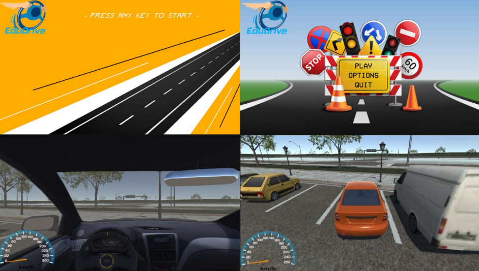

# EduDrive - Driving Simulator Game

## Introduction
EduDrive is a driving simulator designed to help users learn and apply road rules in a virtual environment. By combining serious gaming principles with real-time driving scenarios, EduDrive aims to minimize the required hours of practical driving lessons while making the learning experience engaging and interactive.

## Features
EduDrive offers a unique blend of educational content and interactive gameplay, including:
- **Realistic 3D Graphics:** Immersive driving environments with high-quality visuals.
- **Road Sign Quizzes:** Reinforce knowledge of traffic rules through interactive challenges.
- **Real-Time Driving Scenarios:** Unlike traditional quiz-based apps, EduDrive integrates real-time road situations where players must apply learned rules.
- **Progressive Stages:** The game features multiple levels, each focusing on different driving rules, culminating in a final exam-like stage.



## Gameplay
### Objective
- Successfully complete various game stages to finalize virtual driving training and prepare for a real driving license test.
- Each stage introduces a new driving rule while incorporating previously learned rules.
- The final stage simulates an actual driving test, requiring mastery of all prior rules.

### Rules to Pass a Stage
- Players must adhere to the driving rule(s) of the current stage.
- Violating rules results in automatic disqualification, with on-screen messages indicating the mistakes.
- Players must retry the level until they pass to proceed to the next stage.

## Game Levels
EduDrive consists of multiple levels with increasing difficulty. The first seven levels are implemented in the code, covering:
1. Basic driving controls
2. Traffic light rules
3. Stop signs
4. Speed limit enforcement
5. Parking maneuvers
6. Hazard detection
7. Final driving test

## Core Components & Class Strucuture

```plaintext
                +--------------------+
                |  MonoBehaviour     |
                | (Base Class)       |
                +--------------------+
                          ▲
      +-------------------+-------------------+
      |                   |                   |
+------------+     +------------+     +------------+
| InputManager |     | Controller  |     | CameraManager |
| - Handles    |     | - Applies   |     | - Manages     |
|   user input |     |   changes   |     |   camera      |
+------------+     +------------+     +------------+

      +--------------------------------------------------+
      |               Interface & Graphics               |
      | +----------------------------------------------+ |
      | | CityGenerator, MeshCombineUtility, TrafficLights | |
      | | - Manage and automate graphical elements       | |
      | +----------------------------------------------+ |
      | | Speedometer - Displays the speedometer UI    | |
      | +----------------------------------------------+ |
      +--------------------------------------------------+

      +-------------------------------------------+
      |                Menu System                |
      | +---------------------------------------+ |
      | | SceneLoader - Handles quitting game  | |
      | | Replay - Restart level               | |
      | | NextGame - Move to next level        | |
      | +---------------------------------------+ |
      +-------------------------------------------+

      +-----------------------------------------------+
      |              Detection Algorithms            |
      | +-----------------------------------------+  |
      | | Stopdet - Detects stop signs           |  |
      | | Crusher - Detects accidents            |  |
      | | RedlightCheck - Detects red light      |  |
      | | Triggdet - Detects speed violations    |  |
      | | Triggtest - Detects route completion   |  |
      | | Arrival - Detects final destination    |  |
      | +-----------------------------------------+  |
      +-----------------------------------------------+
```

## 🎮 Game Mechanics
### 🎯 Objective
- Complete driving stages progressively while following real-world traffic rules.
- The final stage simulates the real driving exam.

### 📜 Stage Rules
- Players must adhere to the new rule introduced in each stage.
- Violations result in automatic disqualification, requiring a restart.
- On-screen messages provide feedback on rule infractions.

## ⚙️ Tech Stack
- **Framework:** Unity
- **Programming Language:** C#

## Additional Resources
For assets and design inquiries, please contact privately.

